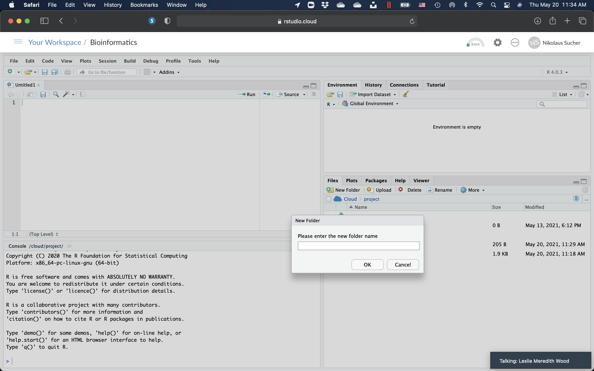

# R, RStudio Cloud, And BioConductor

In this exercise, we will learn how to use R, RStudio Cloud and BioConductor. While you can download R and RStudio for free and install the programs on your own computer, it is easier and convenient to use RStudio in the cloud. It is free for personal use. But let's start with a quick overview first.

[R](https://www.r-project.org) is a programming language and free software environment for statistical computing and graphics supported by the R Foundation for Statistical Computing. The R language is widely used among statisticians and data miners for developing statistical software and data analysis. Polls, data mining surveys, and studies of scholarly literature databases show substantial increases in popularity; as of April 2021, R ranks 16th in the TIOBE index, a measure of popularity of programming languages.

RStudio is an Integrated Development Environment (IDE) for R, a programming language for statistical computing and graphics. It is available in two formats: RStudio Desktop is a regular desktop application while RStudio Server runs on a remote server and allows accessing RStudio using a web browser.

Bioconductor is a free, open source and open development software project for the analysis and comprehension of genomic data generated by wet lab experiments in molecular biology.

Bioconductor is based primarily on the statistical R programming language, but does contain contributions in other programming languages. It has two releases each year that follow the semiannual releases of R. At any one time there is a release version, which corresponds to the released version of R, and a development version, which corresponds to the development version of R. Most users will find the release version appropriate for their needs. In addition there are many genome annotation packages available that are mainly, but not solely, oriented towards different types of microarrays.

While computational methods continue to be developed to interpret biological data, the Bioconductor project is an open source software repository that hosts a wide range of statistical tools developed in the R programming environment. Utilizing a rich array of statistical and graphical features in R, many Bioconductor packages have been developed to meet various data analysis needs. The use of these packages provides a basic understanding of the R programming / command language. As a result, R and Bioconductor packages, which have a strong computing background, are used by most biologists who will benefit significantly from their ability to analyze datasets. All these results provide biologists with easy access to the analysis of genomic data without requiring programming expertise.

The project was started in the Fall of 2001 and is overseen by the Bioconductor core team, based primarily at the Fred Hutchinson Cancer Research Center, with other members coming from international institutions.

Most Bioconductor components are distributed as R packages, which are add-on modules for R. Initially most of the Bioconductor software packages focused on the analysis of single channel Affymetrix and two or more channel cDNA/Oligo microarrays. As the project has matured, the functional scope of the software packages broadened to include the analysis of all types of genomic data, such as SAGE, sequence, or SNP data.

## An Overview of R, RStudio and BioConductor

R is an interpreted language; users typically access it through a command-line interpreter. If a user types 2+2 at the R command prompt and presses enter, the computer replies with 4, as shown below:

```{r addition, echo=TRUE, message=TRUE, warning=TRUE}
2 + 2
```

This calculation is interpreted as the sum of two single-element vectors, resulting in a single-element vector. The prefix  indicates that the list of elements following it on the same line starts with the first element of the vector (a feature that is useful when the output extends over multiple lines).

Like other similar languages such as APL and MATLAB, R supports matrix arithmetic. R's data structures include vectors, matrices, arrays, data frames (similar to tables in a relational database) and lists. Arrays are stored in colum-major order. R's extensible object system includes objects for (among others): regression models, time-series and geo-spatial coordinates. The scalar data type was never a data structure of R. Instead, a scalar is represented as a vector with length one.

R supports procedural programming with functions and, for some functions, object-oriented programming with generic functions. A generic function acts differently depending on the classes of arguments passed to it. In other words, the generic function dispatches the function (method) specific to that class of object. For example, R has a generic print function that can print almost every class of object in R with a simple print(objectname) syntax.

The capabilities of R are extended through user-created packages, which allow specialised statistical techniques, graphical devices, import/export capabilities, reporting tools (RMarkdown, knitr, Sweave), etc. The large number of packages available for R, and the ease of installing and using them, has been cited as a major factor in driving the widespread adoption of the language in data science. The R packaging system is also used by researchers to create compendia to organise research data, code and report files in a systematic way for sharing and public archiving.

A core set of packages is included with the installation of R, with more than 15,000 additional packages (as of September 2018) available at the Comprehensive R Archive Network (CRAN), Bioconductor, Omegahat, GitHub, and other repositories.

The "Task Views" page (subject list) on the CRAN website lists a wide range of tasks (in fields such as Finance, Genetics, High Performance Computing, Machine Learning, Medical Imaging, Social Sciences and Spatial Statistics) to which R has been applied and for which packages are available. R has also been identified by the FDA as suitable for interpreting data from clinical research.

[The Bioconductor project](https://www.bioconductor.org) provides R packages for the analysis of genomic data. This includes object-oriented data-handling and analysis tools for data from Affymetrix, cDNA microarray, and next-generation high-throughput sequencing methods.

A group of packages called the Tidyverse, which can be considered a "dialect of the R language", is increasingly popular in the R ecosystem. The group of packages strives to provide a cohesive collection of functions to deal with common data science tasks, including data import, cleaning, transformation and visualisation (notably with the ggplot2 package).

The official R software environment is a [GNU](https://en.wikipedia.org/wiki/GNU_Project) package. It is written primarily in C, Fortran, and R itself (thus, it is partially self-hosting) and is freely available under the GNU General Public License. Pre-compiled executables are provided fr various operating systems. Although R has a command line interface, there are several third-party graphical user interfaces, such as [RStudio](https://www.rstudio.com), an integrated development environment, and Jupyter, a notebook interface.

## RStudio Cloud

RStudio Cloud allows anyone to do, share, teach and learn data science online. We will use it to learn how to use BioConductor.

There is nothing to configure and no dedicated hardware, installation or annual purchase contract required. We only need a browser.

1. Open a web browser and go to: https://rstudio.cloud

2. When the page opens, click on "GET STARTED FOR FREE".

```{r rstudiocloud, fig.cap='The RStudio Cloud landing page.', echo=FALSE, message=FALSE, warning=FALSE}

```

3. On the next page, click on "Sign Up" on the bottom right.

```{r getstarted, fig.cap='The RStudio Cloud "Get started" page.', echo=FALSE, message=FALSE, warning=FALSE}

```

4.Fill in the required information on the next page.

```{r signup, fig.cap='The RStudio Cloud sign-up page.', echo=FALSE, message=FALSE, warning=FALSE}
knitr::include_graphics("./figures/bioconductor/SignUpForm.png")
```

5. Once you are logged in, click on "New Project" on the top right. You can name the project anything you like, for example "Bioinformatics".

```{r newproject, fig.cap='Create a new poject.', echo=FALSE, message=FALSE, warning=FALSE}

```

6. Then, click on the project. The RStudio workspace page will open.

```{r workspace, fig.cap='The RStudio Workspace.', echo=FALSE, message=FALSE, warning=FALSE}

```

7. On the right, click on the "Files" tab, then on "New Folder". In the pop-up window, enter "data" (without the quotes) and click "OK".

```{r newfolder, fig.cap='Create a new folder.', echo=FALSE, message=FALSE, warning=FALSE}

```

## Basic syntax of R

The following examples illustrate the basic syntax of the language and use of the command-line interface. (An expanded list of standard language features can be found in the R manual, "An Introduction to R".)

1. Copy the first three lines below and paste them into the "Console" pane on the lower left side of your RStudio workspace window and hit "return". You should see the output printed beginning with "#>" below. You can continue and enter the remaining commands listed below and observe the output that is generated.

In R, the generally preferred assignment operator is an arrow made from two characters <-, although = can be used in some cases.

```{r examples, echo=TRUE, message=TRUE, warning=TRUE}

x <- 1:6 # Create a numeric vector in the current environment
y <- x^2 # Create vector based on the values in x.
print(y) # Print the vector’s contents.

z <- x + y # Create a new vector that is the sum of x and y
z # return the contents of z to the current environment.

z_matrix <- matrix(z, nrow=3) # Create a new matrix that tuns the vector z into a 3x2 matrix object
z_matrix 

2*t(z_matrix)-2 # Transpose the matrix, multiply every element by 2, subtract 2 from each element in the matrix, and return the results to the terminal.

new_df <- data.frame(t(z_matrix), row.names=c('A','B')) # Create a new data.frame object that contains the data from a transposed z_matrix, with row names 'A' and 'B'

names(new_df) <- c('X','Y','Z') # set the column names of new_df as X, Y, and Z.

print(new_df)  #print the current results.

new_df$Z #output the Z column

new_df$Z==new_df['Z'] && new_df==new_df$Z # the data.frame column Z can be accessed using $Z, ['Z'], or  syntax, and the values are the same. 

attributes(new_df) #print attributes information about the new_df object

attributes(new_df)$row.names <- c('one','two') ## access and then change the row.names attribute; can also be done using rownames()
new_df
```

One of R's strengths is the ease of creating new functions. Objects in the function body remain local to the function, and any data type may be returned. Here is an example user-created function:

```{r function, echo=TRUE, message=TRUE, warning=TRUE}
 
# Declare function “f” with parameters “x”, “y“
# that returns a linear combination of x and y.
f <- function(x, y) {
  z <- 3 * x + 4 * y
  return(z) ## the return() function is optional here
}
f(1, 2)

f(c(1,2,3), c(5,3,4))

f(1:3, 4)
```

## Download AB1 Sequence File

1. Now that you have a basic understanding of the R syntax, download the sequence file in ab1 format.

```{r ab1, echo=FALSE, message=FALSE, warning=FALSE}
library(downloadthis)
## Link in Github repo
download_link(
  link = "https://github.com/nikolaussucher/bioinformatics/raw/main/data/78_4212_91_EQ-CHF3_4239_SQ_F10_035.ab1",
  button_label = "Download AB1 file",
  button_type = "danger",
  has_icon = TRUE,
  icon = "fa fa-save",
  self_contained = FALSE
)
```

2. On the right, click on the "Files" tab, ,click on the "data" folder. Once you are in the data folder, click on "Upload". In the pop-up window, click "Choose File" and find the file on your computer. Click "Ok" and upload the file to RStudio Cloud. Click on the green arrow to go back to your main directory.

```{r upload, fig.cap='Upload the AB1 sequence file to RStudio Cloud.', echo=FALSE, message=FALSE, warning=FALSE}
knitr::include_graphics("./figures/bioconductor/upload_file.png")
```

## Download And Run The R Program

1. Download a text file with the commands (the program) that we will run in R.

```{r script, echo=FALSE, message=FALSE, warning=FALSE}
library(downloadthis)
## Link in Github repo
download_link(
  link = "https://github.com/nikolaussucher/bioinformatics/raw/main/data/sequence_analysis.R",
  button_label = "Download R script",
  button_type = "danger",
  has_icon = TRUE,
  icon = "fa fa-save",
  self_contained = FALSE
)
```

2. On the right, click on the "Files" tab, then on "Upload". In the pop-up window, click "Choose File" and find the file on your computer. Click "Ok" and upload the file to the main directory of your RStudio Cloud project.
3. Click on the "sequence_analysis.R" file. It will open in the pane on the top left side of your RStudio window.
4. Read every line of the script. Lines starting with "#", are comments that explain what the following R commands mean. 
5. Click on "Source on the top left of the tab that displays the contents of the "sequence_analysis.R" file and choose "Source". The script with the R commands will then be executed. Follow the progress by watching the output generated in the "Console" pane on the lower left. The "BLAST" search may take a while and you my be required to answer "yes (y)" or "no (n)" to the question if you want to keep waiting or not. If everything goes well and you don't see any red error messages when the prrogram has completed, you should see a bunch of new files in your data folder. Click on each file and view the results.
   
(ref:chromatogram) The DNA sequence chromatogram obtained from sequencing the PCR products from the unknown organism. This chromatogram was produced using the free and open-source software programs [R](https://www.r-project.org) and [Bioconductor](https://bioconductor.org) package [sangerseqR](https://bioconductor.org/packages/release/bioc/html/sangerseqR.html). 

```{r chrom, fig.cap='(ref:chromatogram)', echo=FALSE, message=FALSE, warning=FALSE}
knitr::include_graphics("./data/sequence_chromatogram.pdf")
```

```{r alignment, fig.cap='The sequence alingment.', echo=FALSE, message=FALSE, warning=FALSE}
knitr::include_graphics("./Equisetum_alignment.pdf")
```


