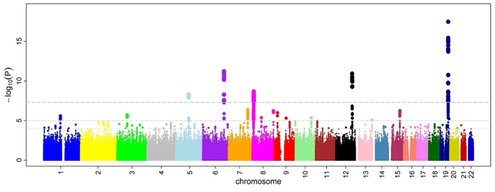

# The Human Genome

In this exercise, we will take a closer look at the human genome and known variations that distinguish different populations and variations that have been linked to increased risk for certain diseases.

The [human genome](https://en.wikipedia.org/wiki/Human_genome) is the complete set of nucleic acid sequences for humans, encoded as DNA within the 23 chromosome pairs in cell nuclei and in a small DNA molecule found within mitochondria. The human genome includes both protein-coding DNA genes and noncoding DNA. The haploid human genome in egg and sperm cells consists of more than three billion DNA base pairs (Table \@ref(tab:chr)), while the diploid genome in somatic cells has twice the DNA content. The Human Genome Project (HGP) produced the first (almost) complete sequence of the human genome, with the first draft sequence and initial analysis being published in 2001.

(ref:kar) [Graphical representation](https://commons.wikimedia.org/wiki/File:Karyotype.png) of the idealized human diploid karyotype, showing the organization of the genome into chromosomes. This drawing shows both the female (XX) and male (XY) versions of the 23rd chromosome pair. Chromosomes are shown aligned at their centromeres. The mitochondrial DNA is not shown. 

```{r karyo, fig.cap='(ref:kar)', echo=FALSE, message=FALSE, warning=FALSE}
knitr::include_graphics("./figures/human_genome/Karyotype.png")
```

## The Human Genome Project

The [Human Genome Project](https://en.wikipedia.org/wiki/Human_Genome_Project) was an international scientific research project with the goal of determining the sequence of nucleotide base pairs that make up human DNA, and of identifying and mapping all of the genes of the human genome from both a physical and a functional standpoint. After the idea was picked up in 1984 by the US government when the planning started, the project formally launched in 1990 and was declared complete in 2003. Funding came from the US government through the National Institutes of Health (NIH) as well as numerous other groups from around the world. A parallel project was conducted outside government by the Celera Corporation, or Celera Genomics, which was formally launched in 1998. Most of the government-sponsored sequencing was performed in twenty universities and research centers in the United States, the United Kingdom, Japan, France, Germany, Spain and China.

The Human Genome Project originally aimed to map the nucleotides contained in a human haploid reference genome (more than three billion). The project was not able to sequence all the DNA found in human cells. It sequenced only euchromatic regions of the genome, which make up 92% of the human genome. The other regions, called heterochromatic, are found in centromeres and telomeres, and were not sequenced under the project. An initial rough draft of the human genome was available in June 2000 and by February 2001 a working draft had been completed and published followed by the final sequencing mapping of the human genome on April 14, 2003. Although this was reported to cover 99% of the euchromatic human genome with 99.99% accuracy, a major quality assessment of the human genome sequence was published on May 27, 2004 indicating over 92% of sampling exceeded 99.99% accuracy which was within the intended goal. Further analyses and papers on the HGP continue to occur.

The most recent official version of the human genome sequence is the Dec. 2013 (GRCh38/hg38) assembly of the human genome (hg38, GRCh38 Genome Reference Consortium Human Reference 38 (GCA_000001405.15)). The Dec. 2013 human reference sequence (GRCh38) was produced by the [Genome Reference Consortium](http://www.ncbi.nlm.nih.gov/projects/genome/assembly/grc/).

An assembly is a set of chromosomes, unlocalized and unplaced (random) sequences and alternate loci used to represent an organism's genome. Most current assemblies are a haploid representation of an organism's genome, although some loci may be represented more than once. The human genome reference assembly has been obtained from multiple individuals. The haploid assembly does not represent a single haplotype, but rather a mixture of haplotypes. As sequencing technology evolves, it is anticipated that diploid sequences representing an individual's genome will become available.

A haplotype (haplo: from Ancient Greek ὰπλόος (haplos, single, simple)) is a contiguous section of closely linked segments of DNA within the larger genome that tend to be inherited together as a unit on a single chromosome. Haplotypes have no defined size and can refer to anything from a few closely linked loci up to an entire chromosome. The term is also used to describe groups of single-nucleotide polymorphisms (SNPs) that are statistically associated. 

The term 'haplogroup' refers to the SNP/unique-event polymorphism (UEP) mutations that represent the clade to which a collection of particular human haplotypes belong. (Clade here refers to a set of haplotypes sharing a common ancestor.) A haplogroup is a group of similar haplotypes that share a common ancestor with a single-nucleotide polymorphism mutation. Mitochondrial DNA passes along a maternal lineage hat can date back thousands of years. Similarly, the Y-chromosome passes along the paternal lineage.

A chromosome assembly represents a relatively complete pseudo-molecule assembled from smaller sequences (components) that represent a biological chromosome. Relatively complete implies that some gaps may still be present in the assembly (e.g. there are still gaps in the human genome assembly), but independent measures suggest that most of the sequence is represented by sequenced bases. An unlocalized sequence is a sequence found in an assembly that is associated with a specific chromosome but cannot be ordered or oriented on that chromosome. An unplaced sequence is a sequence found in an assembly that is not associated with any chromosome.

Assemblies are built from components, which in turn are joined to form contigs, which are used to build scaffolds (definitions of these and other relevant terms can be found on the [GRC web site](https://www.ncbi.nlm.nih.gov/grc/help/definitions/#ALTERNATE)).

Table: (\#tab:chr) [Human Genome Assembly GRCh38.p12](https://www.ncbi.nlm.nih.gov/grc/human/data) (Release date: 2017-12-21). Length of DNA sequence of each human chromosome. Total lengths are calculated by summing the length of the sequenced bases and estimated gaps. Ungapped lengths are calculated by summing the length of sequenced bases only. 'Ns' are excluded.

|Chromosome|Total length |Ungapped length| 
|:--------:|------------:|--------------:|
|1	   | 248,956,422 | 231,223,641   | 		
|2	   | 242,193,529 | 240,863,511	 |     
|3	   | 198,295,559 | 198,255,541	 |     
|4	   | 190,214,555 | 189,962,376	 |     
|5	   | 181,538,259 | 181,358,067	 |     
|6	   | 170,805,979 | 170,078,524	 |     
|7	   | 159,345,973 | 158,970,135	 |     
|8	   | 145,138,636 | 144,768,136	 |     
|9	   | 138,394,717 | 122,084,564	 |     
|10	   | 133,797,422 | 133,263,006	 |     
|11	   | 135,086,622 | 134,634,058	 |     
|12	   | 133,275,309 | 133,137,821	 |     
|13	   | 114,364,328 | 97,983,128	 |     
|14	   | 107,043,718 | 91,660,769	 |     
|15	   | 101,991,189 | 85,089,576	 |     
|16	   | 90,338,345  | 83,378,703	 |
|17	   | 83,257,441  | 83,481,871	 |
|18	   | 80,373,285  | 80,089,650	 |
|19	   | 58,617,616  | 58,440,758	 |
|20	   | 64,444,167  | 63,944,268	 |
|21	   | 46,709,983  | 40,088,623	 |
|22	   | 50,818,468  | 40,181,019	 |
|X	   | 156,040,895 | 154,893,034	 |	     
|Y	   | 57,227,415  | 26,452,288	 |
|MT        | 16,569      |               |
|Unplaced  | 4,485,509   | 4,328,403	 |
|Genome    |3,099,734,149| 2,948,611,470 |

HGP scientists used white blood cells from the blood of two male and two female donors (randomly selected from 20 of each) each donor yielding a separate DNA library. One of these libraries (RP11) was used considerably more than others, due to quality considerations. More than 70% of the reference genome produced by the public HGP came from RP11, a single anonymous male donor from Buffalo, New York (code name RP11).

The genome was broken into smaller pieces; approximately 150,000 base pairs in length. These pieces were then ligated into a type of vector known as "bacterial artificial chromosomes", or BACs, which are derived from bacterial chromosomes which have been genetically engineered. The vectors containing the genes can be introduced into bacteria where they are copied by the bacterial DNA replication machinery. Each of these pieces was then sequenced separately as a small "shotgun" project and then assembled. The larger, 150,000 base pairs go together to create chromosomes. This is known as the "hierarchical shotgun" approach, because the genome is first broken into relatively large chunks, which are then mapped to chromosomes before being selected for sequencing.

The "genome" of any given individual is unique; mapping the "human genome" involved sequencing a small number of individuals and then assembling these together to get a complete sequence for each chromosome. Therefore, the finished human genome is a mosaic, not representing any one individual. In fact, we now know that there is variation in the genomes of individual cells in any one human. The implications of this recent finding for human health will keep scientists busy for a long time.

## Genome Annotation

A gene (from genos  (Greek) meaning generation or birth  or gender) is a basic unit of heredity and a sequence of nucleotides in DNA or RNA that encodes the synthesis of a gene product, either RNA or protein.

(ref:gene) [A gene is a region of DNA that encodes function. A chromosome consists of a long strand of DNA containing many genes. A human chromosome can be up to 250 mega base pairs of DNA and contain thousands of genes.](https://en.wikipedia.org/wiki/File:Chromosome_DNA_Gene.svg) 

```{r genes, fig.cap='(ref:gene)', echo=FALSE, message=FALSE, warning=FALSE}

```


During gene expression, the DNA is first copied into RNA. The RNA can be directly functional or be the intermediate template for a protein that performs a function. The transmission of genes to an organism's offspring is the basis of the inheritance of phenotypic traits. These genes make up different DNA sequences called genotypes. Genotypes along with environmental and developmental factors determine what the phenotypes will be. Most biological traits are under the influence of polygenes (many different genes) as wll as gene–environment interactions. Some genetic traits are instantly visible, such as eye color or the number of limbs, and some are not, such as blood type, the risk for specific diseases, or the thousands of basic biochemical processes that constitute life.

Genes can acquire mutations in their sequence, leading to different variants, known as alleles, in the population. These alleles encode slightly different versions of a protein, which cause different phenotypical traits. Usage of the term "having a gene" (e.g., "good genes," "hair color gene") typically refers to containing a different allele of the same, shared gene. Genes evolve due to natural selection / survival of the fittest and genetic drift of the alleles.

The concept of gene continues to be refined as new phenomena are discovered. For example, regulatory regions of a gene can be far removed from its coding regions, and coding regions can be split into several exons. Some viruses store their genome in RNA instead of DNA and some gene products are functional non-coding RNAs. Therefore, a broad, modern working definition of a gene is any discrete locus of heritable, genomic sequence which affect an organism's traits by being expressed as a functional product or by regulation of gene expression.

The term gene was introduced by Danish botanist, plant physiologist and geneticist Wilhelm Johannsen in 1909. It is inspired by the ancient Greek: γόνος, gonos, that means offspring and procreation.e

The process of identifying the boundaries between genes and other features in a raw DNA sequence is called genome annotation and is in the domain of bioinformatics. Annotation of genes (coding sequences, CDS) is provided by multiple public resources, using different methods, and resulting in information that is similar but not always identical. The [Consensus CDS (CCDS) project](https://www.ncbi.nlm.nih.gov/projects/CCDS/CcdsBrowse.cgi) is a collaborative effort to identify a core set of protein coding regions that are consistently annotated and of high quality and support convergence towards a standard set of gene annotations. While expert biologists make the best annotators, their work proceeds slowly, and computer programs are increasingly used to meet the high-throughput demands of genome sequencing projects. Beginning in 2008, a new technology known as [RNA-seq](https://en.wikipedia.org/wiki/RNA-Seq) was introduced that allowed scientists to directly sequence the messenger RNA in cells. This replaced previous methods of annotation, which relied on inherent properties of the DNA sequence, with direct measurement, which was much more accurate. Today, annotation of the human genome and other genomes relies primarily on deep sequencing of the transcripts in every human tissue using RNA-seq. These experiments have revealed that over 90% of genes contain at least one and usually several alternative splice variants, in which the exons are combined in different ways to produce 2 or more gene products from the same locus.

Table: (\#tab:gene) Human Genome Assembly GRCh38.p12 (Release date: 2017-12-21). GC content (%) and number of proteins, ribosomal RNA (rRNA), transfer RNA (tRNA), other RNA, genes and pseudogenes on each chromosome. Retrieved on August 10, 2018 at https://www.ncbi.nlm.nih.gov/genome/?term=txid9606[orgn]

|Name  |GC (%) |Protein|rRNA|tRNA|Other RNA|Gene  |Pseudogene|
|:-----|------:|------:|---:|---:|--------:|-----:|---------:|
|Chr 1 |42.3   |11,321 | 17 |90  |4,457    |5,109 |1,386     |
|Chr 2 |40.3   |8,291  | -  |7   |3,728    |3,871 |1,181     |
|Chr 3 |39.7   |7,150  | -  |4   |2,782    |2,990 |900       |
|Chr 4 |38.3   |4,599  | -  |1   |2,193    |2,441 |803       |
|Chr 5 |39.5   |4,729  | -  |17  |2,194    |2,592 |778       |
|Chr 6 |39.6   |5,522  | -  |138 |2,453    |3,005 |882       |
|Chr 7 |40.7   |5,112  | -  |22  |2,330    |2,792 |911       |
|Chr 8 |40.2   |4,199  | -  |4   |2,011    |2,165 |671       |
|Chr 9 |42.3   |4,699  | -  |3   |2,222    |2,270 |706       |
|Chr 10|41.6   |5,429  | -  |3   |2,133    |2,179 |640       |
|Chr 11|41.6   |6,394  | -  |13  |2,336    |2,924 |829       |
|Chr 12|40.8   |5,975  | -  |9   |2,457    |2,526 |691       |
|Chr 13|40.2   |2,056  | -  |4   |1,243    |1,385 |475       |
|Chr 14|42.2   |3,501  | -  |18  |1,704    |2,065 |585       |
|Chr 15|43.4   |3,623  | -  |9   |1,810    |1,824 |554       |
|Chr 16|45.1   |4,625  | -  |27  |1,761    |1,938 |469       |
|Chr 17|45.3   |6,226  | -  |33  |2,243    |2,450 |556       |
|Chr 18|39.8   |2,029  | -  |1   |996      |984   |295       |
|Chr 19|47.9   |6,750  | -  |6   |1,877    |2,499 |523       |
|Chr 20|43.9   |2,904  | -  |-   |1,308    |1,358 |338       |
|Chr 21|42.2   |1,297  | 12 |1   |707      |77    |207       |
|Chr 22|47.7   |2,582  | -  |-   |1,014    |1,189 |354       |
|Chr X |39.6   |3,801  | -  |4   |1,265    |2,186 |875       |
|Chr Y |45.4   |324    | -  |-   |311      |580   |392       |
|MT    |44.4   |13     | 2  |22  |-	       |37    | -        |
|Un    |44.3   |6,143  | 17 |161 |3,437    |6,543 |1,878     |


Table: (\#tab:cds) Gene counts based on the [Ensembl human genome annotations](http://useast.ensembl.org/Homo_sapiens/Info/Annotation) of the primary assembly of GRCh38.p12 (Genome Reference Consortium Human Build 38).

|Coding sequence type     | Count                         |
|:------------------------|------------------------------:|
|**Coding genes**         | 20,376 (incl 612 readthrough) |
|**Non coding genes**     | 22,305                        |
|  Small non coding genes | 5,363                         |
|  Long non coding genes  | 14,720 (incl 256 readthrough) |
|  Misc non coding genes  | 2,222                         |
|**Pseudogenes**          | 14,692 (incl 7 readthrough)   |
|**Gene transcripts**     | 203,903                       |

## Single-nucleotide Polymorphism

A single-nucleotide polymorphism (SNP /snɪp/; plural /snɪps/) is a substitution of a single nucleotide at a specific position in the genome. Although certain definitions require the substitution to be present in a sufficiently large fraction of the population (e.g. 1% or more), many publications do not apply such a frequency threshold.

For example, at a specific base position in the human genome, the G nucleotide may appear in most individuals, but in a minority of individuals, the position is occupied by an A. This means that there is a SNP at this specific position, and the two possible nucleotide variations – G or A – are said to be the alleles for this specific position.

SNPs pinpoint differences in our susceptiility to a wide range of diseases (e.g. sickle-cell anemia, β-thalassemia and cystic fibrosis). The severity of illness and the way the body responds to treatments are also manifestations of genetic variations caused by SNPs. For example, a single-base mutation in the APOE (apolipoprotein E) gene is associated with a lower risk for Alzheimer's disease.

A single-nucleotide variant (SNV) is a variation in a single nucleotide. SNVs differ from SNPs in that a SNV can be somatic and can be caused by cancer, but a SNP has to segregate in a species' population of organisms. SNVs also commonly arise in molecular diagnostics such as designing PCR primers to detect viruses, in which the viral RNA or DNA sample may contain SNVs.

Single-nucleotide polymorphisms may fall within coding sequences of genes, non-coding regions of genes, or in the intergenic regions (regions between genes). SNPs within a coding sequence do not necessarily change the amino acid sequence of the protein that is produced, due to degeneracy of the genetic code.

SNPs in the coding region are of two types: synonymous and nonsynonymous SNPs. Synonymous SNPs do not affect the protein sequence, while nonsynonymous SNPs change the amino acid sequence of protein.

* SNPs in non-coding regions can manifest in a higher risk of cancer, and may affect mRNA structure and disease susceptibility. Non-coding SNPs can also alter the level of expression of a gene, as an eQTL (expression quantitative trait locus).
* SNPs in coding regions:
  * synonymous substitutions by definition do not result in a change of amino acid in the protein, but still can affect its function in other ways. An example would be a seemingly silent mutation in the multidrug resistance gene 1 (MDR1), which codes for a cellular membrane pump that expels drugs from the cell, can slow down translation and allow the peptide chain to fold into an unusual conformation, causing the mutant pump to be less functional (in MDR1 protein e.g. C1236T polymorphism changes a GGC codon to GGT at amino acid position 412 of the polypeptide (both encode glycine) and the C3435T polymorphism changes ATC to ATT at position 1145 (both encode isoleucine)).
  * nonsynonymous substitutions:
    * missense – single change in the base results in change in amino acid of protein and its malfunction which leads to disease (e.g. c.1580G>T SNP in LMNA gene – position 1580 (nt) in the DNA sequence (CGT codon) causing the guanine to be replaced with the thymine, yielding CTT codon in the DNA sequence, results at the protein level in the replacement of the arginine by the leucine in the position 527, at the phenotype level this manifests in overlapping mandibuloacral dysplasia and progeria syndrome)
    * nonsense – point mutation in a sequence of DNA that results in a premature stop codon, or a nonsense codon in the transcribed mRNA, and in a truncated, incomplete, and usually nonfunctional protein product (e.g. Cystic fibrosis caused by the G542X mutation in the cystic fibrosis transmembrane conductance regulator gene).
SNPs that are not in protein-coding regions may still affect gene splicing, transcription factor binding, messenger RNA degradation, or the sequence of noncoding RNA. Gene expression affected by this type of SNP is referred to as an eSNP (expression SNP) and may be upstream or downstream from the gene.

More than 335 million SNPs have been found across humans from multiple populations. A typical genome differs from the reference human genome at 4 to 5 million sites, most of which (more than 99.9%) consist of SNPs and short indels.

The genomic distribution of SNPs is not homogenous; SNPs occur in non-coding regions more frequently than in coding regions or, in general, where natural selection is acting and "fixing" the allele (eliminating other variants) of the SNP that constitutes the most favorable genetic adaptation. Other factors, like genetic recombination and mutation rate, can also determine SNP density.

SNP density can be predicted by the presence of microsatellites: AT microsatellites in particular are potent predictors of SNP density, with long (AT)(n) repeat tracts tending to be found in regions of significantly reduced SNP density and low GC content.

There are variations between human populations, so a SNP allele that is common in one geographical or ethnic group may be much rarer in another. Within a population, SNPs can be assigned a minor allele frequency—the lowest allele frequency at a locus that is observed in a particular population. This is simply the lesser of the two allele frequencies for single-nucleotide polymorphisms.

With this knowledge scientists have developed new methods in analyzing population structures in less studied species. By using pooling techniques the cost of the analysis is significantly lowered.[citation needed] These techniques are based on sequencing a population in a pooled sample instead of sequencing every individual within the population by itself. With new bioinformatics tools there is a possibility of investigating population structure, gene flow and gene migration by observing the allele frequencies within the entire population. With these protocols there is a possibility in combining the advantages of SNPs with micro satellite markers. However, there are information lost in the process such as linkage disequilibrium and zygosity information.
        
Variations in the DNA sequences of humans can affect how humans develop diseases and respond to pathogens, chemicals, drugs, vaccines, and other agents. SNPs are also critical for personalized medicine. Examples include biomedical research, forensics, pharmacogenetics, and disease causation, as outlined below.

SNPs' greatest importance in clinical research is for comparing regions of the genome between cohorts (such as with matched cohorts with and without a disease) in genome-wide association studies (GWAS). SNPs have been used in genome-wide association studies as high-resolution markers in gene mapping related to diseases or normal traits. SNPs without an observable impact on the phenotype (so called silent mutations) are till useful as genetic markers in genome-wide association studies, because of their quantity and the stable inheritance over generations.

(ref:manh) [An illustration of a Manhattan plot depicting several strongly associated risk loci](https://commons.wikimedia.org/wiki/File:Manhattan_Plot.png). A Manhattan plot is a type of scatter plot, usually used to display data with a large number of data-points, many of non-zero amplitude, and with a distribution of higher-magnitude values. The plot is commonly used in genome-wide association studies (GWAS) to display significant SNPs. It gains its name from the similarity of such a plot to the Manhattan skyline: a profile of skyscrapers towering above the lower level "buildings" which vary around a lower height. In GWAS Manhattan plots, genomic coordinates are displayed along the X-axis, with the negative logarithm of the association p-value for each single nucleotide polymorphism (SNP) displayed on the Y-axis, meaning that each dot on the Manhattan plot signifies a SNP. Because the strongest associations have the smallest p-values (e.g., 10−15), their negative logarithms will be the greatest (e.g., 15). The different colors of each block usually show the extent of each chromosome

```{r manhattan, fig.cap='(ref:manh)', echo=FALSE, message=FALSE, warning=FALSE}

```


SNPs have historically been used to match a forensic DNA sample to a suspect but has been made obsolete due to advancing STR-based DNA fingerprinting techniques. However, the development of next-generation-sequencing (NGS) technology may allow for more opportunities for the use of SNPs in phenotypic clues such as ethnicity, hair color, and eye color with a good probability of a match. This can additionally be applied to increase the accuracy of facial reconstructions by providing information that may otherwise be unknown, and this information can be used to help identify suspects even without a STR DNA profile match.

Some cons to using SNPs versus STRs is that SNPs yield less information than STRs, and therefore more SNPs are needed for analysis before a profile of a suspect is able to be created. Additionally, SNPs heavily rely on the presence of a database for comparative analysis of samples. However, in instances with degraded or small volume samples, SNP techniques are an excellent alternative to STR methods. SNPs (as opposed to STRs) have an abundance of potential markers, can be fully automated, and a possible reduction of required fragment length to less than 100bp.

Some SNPs are associated with the metabolism of different drugs. SNP's can be mutations, such as deletions, which can inhibit or promote enzymatic activity; such change in enzymatic activity can lead to decreased rates of drug metabolism The association of a wide range of human diseases like cancer, infectious diseases (AIDS, leprosy, hepatitis, etc.) autoimmune, neuropsychiatric and many other diseases with different SNPs can be made as relevant pharmacogenomic targets for drug therapy.

A single SNP may cause a Mendelian disease, though for complex diseases, SNPs do not usually function individually, rather, they work in coordination with other SNPs to manifest a disease such as in Osteoporosis. One of the earliest successes in this field was finding a single base mutation in the non-coding region of the APOC3 (apolipoprotein C3 gene) that associated with higher risks of hypertriglyceridemia and atherosclerosis.. Some diseases caused by SNPs include rheumatoid arthritis, crohn’s disease, breast cancer, alzheimer's, and some autoimmune disorders. Large scale association studies have been performed to attempt to discover additional disease causing SNPs within a population , but a large number of them are still unknown.

## The Single Nucleotide Polymorphism Database (dbSNP) of Nucleotide Sequence Variation

The [Single Nucleotide Polymorphism database](https://www.ncbi.nlm.nih.gov/books/NBK21088/) (dbSNP) is a public-domain archive for a broad collection of simple genetic polymorphisms. This collection of polymorphisms includes single-base nucleotide substitutions (also known as single nucleotide polymorphisms or SNPs), small-scale multi-base deletions or insertions (also called deletion insertion polymorphisms or DIPs), and retroposable element insertions and microsatellite repeat variations (also called short tandem repeats or STRs). Please note that in this chapter, you can substitute any class of variation for the term SNP. Each dbSNP entry includes the sequence context of the polymorphism (i.e., the surrounding sequence), the occurrence frequency of the polymorphism (by population or individual), and the experimental method(s), protocols, and conditions used to assay the variation.

The Reference SNP cluster ID (rsid) is an accession number used to refer to specific SNPs in the database. 

## International HapMap Project

[The International HapMap Project](https://en.wikipedia.org/wiki/International_HapMap_Project) was an organization that aimed to develop a haplotype map (HapMap) of the human genome, to describe the common patterns of human genetic variation. HapMap is used to find genetic variants affecting health, disease and responses to drugs and environmental factors. The information produced by the project was made freely available for research.

Four populations were selected for inclusion in the HapMap: 30 adult-and-both-parents Yoruba trios from Ibadan, Nigeria (YRI), 30 trios of Utah residents of northern and western European ancestry (CEU), 44 unrelated Japanese individuals from Tokyo, Japan (JPT) and 45 unrelated Han Chinese individuals from Beijing, China (CHB). 

All samples were collected through a community engagement process with appropriate informed consent. The community engagement process was designed to identify and attempt to respond to culturally specific concerns and give participating communities input into the informed consent and sample collection processes.

In phase III, 11 global ancestry groups were assembled: ASW (African ancestry in Southwest USA); CEU (Utah residents with Northern and Western European ancestry from the CEPH collection); CHB (Han Chinese in Beijing, China); CHD (Chinese in Metropolitan Denver, Colorado); GIH (Gujarati Indians in Houston, Texas); JPT (Japanese in Tokyo, Japan); LWK (Luhya in Webuye, Kenya); MEX (Mexican ancestry in Los Angeles, California); MKK (Maasai in Kinyawa, Kenya); TSI (Tuscans in Italy); YRI (Yoruba in Ibadan, Nigeria).

Through this research millions of SNPs were discovered and many GWAS studies used this dataset in research for disease association. This project was a stepping stone for the 1000 genomes project which utilizes many of the same populations.

## The 1000 Genomes Project

The [1000 Genomes Project](https://en.wikipedia.org/wiki/1000_Genomes_Project) launched in January 2008, is an international research effort to establish by far the most detailed catalogue of human genetic variation (Table \@ref(tab:thousand)). Scientists planned to sequence the genomes of at least one thousand anonymous participants from a number of different ethnic groups within the following three years, using newly developed technologies which were faster and less expensive. In 2015, two papers in the journal Nature reported results and the completion of the project and opportunities for future research. Many rare variations, restricted to closely related groups, were identified, and eight structural-variation classes were analyzed.

The project unites multidisciplinary research teams from institutes around the world, including China, Italy, Japan, Kenya, Nigeria, Peru, the United Kingdom, and the United States. The team have been contributing to the enormous sequence dataset and to a refined human genome map, which are freely accessible through public databases to the scientific community and the general public alike. The [International Genome Sample Resource](http://www.internationalgenome.org/home) (IGSR) was established at the European Bioinformatics Institute ([EMBL-EBI](https://www.ebi.ac.uk)) in January 2015. The resource was established with three main [aims](http://www.internationalgenome.org/sample_collection_principles), to:

1. Ensure maximal usefulness and relevance of the existing 1000 Genomes data resources
2. Extend the resource for the existing populations
3. Expand the resource to new populations

By providing an overview of all human genetic variation, the consortium has generated a valuable tool for all fields of biological science, especially in the disciplines of genetics, medicine, pharmacology, biochemistry, and bioinformatics.

Table: (\#tab:thousand) Populations represented in the 1000 genomes collection.

|Superpopulation|Description                                                         |Population|Samples|	
|:-------------:|:-------------------------------------------------------------------|:--------:|:-----:|
|AFR	        |African Ancestry in Southwest US	                             |ASW       | 112   |	
|AFR	        |African Caribbean in Barbados	                                     |ACB       | 123   |	
|AFR	        |Esan in Nigeria	                                             |ESN       | 173   |	
|AFR	        |Gambian in Western Division, The Gambia - Fula	                     |GWF       | 100   |
|AFR	        |Gambian in Western Division, The Gambia - Mandinka                  |GWD       | 280   |
|AFR            |Gambian in Western Division, The Gambia - Wolof	             |GWW       | 100   |
|AFR	        |Luhya in Webuye, Kenya	                                             |LWK       | 116   |	
|AFR	        |Mende in Sierra Leone	                                             |MSL       | 128   |	
|AFR	        |Yoruba in Ibadan, Nigeria	                                     |YRI       | 186   |	
|AMR	        |Colombian in Medellin, Colombia	                             |CLM       | 148   |	
|AMR	        |Mexican Ancestry in Los Angeles, California                         |MXL       | 107   |	
|AMR	        |Peruvian in Lima, Peru	                                             |PEL       | 130   |	
|AMR	        |Puerto Rican in Puerto Rico	                                     |PUR       | 150   |	
|EAS	        |Chinese Dai in Xishuangbanna, China	                             |CDX       | 109   |	
|EAS	        |Han Chinese in Beijing, China	                                     |CHB       | 112   |	
|EAS	        |Han Chinese South	                                             |CHS       | 171   |	
|EAS	        |Japanese in Tokyo, Japan	                                     |JPT       | 105   |	
|EAS	        |Kinh in Ho Chi Minh City, Vietnam	                             |KHV       | 124   |	
|EUR	        |British in England and Scotland	                             |GBR       | 107   |	
|EUR	        |Finnish in Finland	                                             |FIN       | 105   |	
|EUR	        |Iberian populations in Spain	                                     |IBS       | 162   |	
|EUR	        |Toscani in Italy	                                             |TSI       | 112   |	
|EUR	        |Utah residents (CEPH) with Northern and Western European ancestry   |CEU       | 183   |	
|SAS	        |Bengali in Bangladesh	                                             |BEB       | 144   |	
|SAS	        |Gujarati Indian in Houston, TX	                                     |GIH       | 113   |	
|SAS	        |Indian Telugu in the UK	                                     |ITU       | 118   |	
|SAS	        |Punjabi in Lahore, Pakistan	                                     |PJL       | 158   |	
|SAS	        |Sri Lankan Tamil in the UK	                                     |STU       | 128   |	


Some basic statistics about the variant sites on the autosomes (chromosomes 1 to 22) and the X chromosome in phase 3 release version 5a from Feb. 20th, 2015 are listed in Table \@ref(tab:stats). The numbering of chromosome	locations is based on [Genome Reference Consortium Human Build 37 patch release 13](https://www.ebi.ac.uk/ena/data/view/GCA_000001405.14) (GRCh37.p13).

Table: (\#tab:stats) The types and numbers of sites with variations in the autosomes and X chromosome in the genomes of 2504 people examined in the 1000 genomes project (phase 3 v5a).

|Type                  |Autosomes|X chromosome|
|:---------------------|--------:|-----------:|
|SNPs	               |78136341 |3246232     |
|indels	               |3135424  |227112      |
|others	               |58671    |2040        |
|multiallelic sites    |416023   |30994       |
|multiallelic SNP sites|259370   |1505        |
|Total                 |81271745 |3468087     |


(ref:pcaplot) Principle component analysis (PCA) of genetic variation in the 1000 genomes project reveals population stratification. PCA is based on 473,964 autosomal variants with a minor allele frequency greater than 10% in 2504 people from 5 superpopulations.

```{r pca, fig.cap='(ref:pcaplot)', fig.asp = 0.8, fig.width = 6, fig.align = "center", echo=FALSE, message=FALSE, warning=FALSE, dev = "cairo_pdf"}

library("tidyverse")
library(printr)        

setwd("~/Dropbox/R/bioinformatics")

#options(scipen=100, digits=3)

#Read in the eigenvectors generated by plink
eigenvec <- data.frame(read.table("data/plink.eigenvec", header=FALSE, skip=0, sep=" "))
rownames(eigenvec) <- eigenvec[,2]
eigenvec <- eigenvec[,3:ncol(eigenvec)]

#Read the ethnicity
ethnicity <- as.tibble(read.csv("data/ethnic_id.csv"))
#Read superpopulations
super <- as.tibble(read_csv("data/superpopulations.csv"))

#Combine eigenvec with ethnicity on ID
eigen_tibble <- as.tibble(eigenvec, rownames = "ID")
eigen_tibble <- ethnicity %>% inner_join(eigen_tibble)
pop_vec <- inner_join(eigen_tibble, super)

#Plot first component vs. second
ggplot2::ggplot(data = pop_vec) +
  geom_point(mapping = aes(x = eigenvec[,1], y= eigenvec[,2], color = Superpopulation)) +
  labs(x = "Principle component 1", y = "Principle component 2") +
  theme(axis.text.x=element_text(family="sans"))

#ggplot2::ggplot(data = pop_vec) +
#  geom_point(mapping = aes(x = eigenvec[,1], y= eigenvec[,2], shape = Superpopulation, color = Name))

#ggplot2::ggplot(data = pop_vec) +
#  geom_point(mapping = aes(x = eigenvec[,1], y= eigenvec[,2], shape = as.factor(Gender), color = Name))

#Plot first component vs. third
ggplot2::ggplot(data = pop_vec) +
  geom_point(mapping = aes(x = eigenvec[,1], y= eigenvec[,3], color = Superpopulation)) +
  labs(x = "Principle component 1", y = "Principle component 3") +
  theme(axis.text.x=element_text(family="sans"))

#ggplot2::ggplot(data = pop_vec) +
#  geom_point(mapping = aes(x = eigenvec[,1], y= eigenvec[,3], shape = as.factor(Gender), color = Name))
```

## Personal genomics

[Personal genomics](https://en.wikipedia.org/wiki/Personal_genomics) or consumer genetics is the branch of genomics concerned with the sequencing, analysis and interpretation of the genome of an individual. The genotyping stage employs different techniques, including single-nucleotide polymorphism (SNP) analysis chips (typically 0.02% of the genome), or partial or full genome sequencing. Once the genotypes are known, the individual's variations can be compared with the published literature to determine likelihood of trait expression, ancestry inference and disease risk.

Automated high-throughput sequencers have increased the speed and reduced the cost of sequencing, making it possible to offer genetic testing to consumers for less than \$1,000. The emerging market of direct-to-consumer genome sequencing services has brought new questions about both the medical efficacy and the ethical dilemmas associated with widespread knowledge of individual genetic information. Companies like [Ancestry](https://www.ancestry.com) and [23andMe](https://www.23andme.com), however, do not sequence your DNA but perform "genotyping" using DNA microarrays ("genotyping chips") to determine SNPs at hundreds of thousands of locations in your genome. Ancestry, for example state that they examine some 700,000 SNPs. 

Starting in 2005 as a pilot experiment with 10 individuals, the [Harvard Personal Genome Project](https://pgp.med.harvard.edu) (Harvard PGP) pioneered a new form of genomics research. The main goal of the project is to allow scientists to connect human genetic information (human DNA sequence, gene expression, associated microbial sequence data, etc) with human trait information (medical information, biospecimens and physical traits) and environmental exposures.

PGP participants consent to publicly share their genomic and trait data in a free and open manner to be used for unimpeded research and other scientific, patient care and commercial purposes worldwide. Consistent with this consent, the project organizers seek to lower as many barriers as possible to access PGP data and cells to empower and engage the scientific community to drive new knowledge about human biology. The project now has over 5,000 participants.


## Exploring The Human Genome

In this exercise, we will learn how to use the [The Ensembl genome browser](http://useast.ensembl.org/Homo_sapiens/Info/Index).
to find information on specific genes and single nucleotide polymorphisms (SNPs).

### Experimental Procedures

1. Open a web browser and go to the [Ensemble genome browser](http://useast.ensembl.org/Homo_sapiens/Info/Index) (Fig. \@ref(fig:ensembl)). This site provides a data set based on the December 2013 Homo sapiens high coverage assembly GRCh38 from the Genome Reference Consortium.

(ref:genomebrowser) [The Ensembl genome browser web page](http://useast.ensembl.org/Homo_sapiens/Info/Index).

```{r ensembl, fig.cap='(ref:genomebrowser)', echo=FALSE, message=FALSE, warning=FALSE}
knitr::include_graphics("./figures/human_genome/ensembl_browser.png")
`````

2. In the search field on the top left of the page, enter GRIN1 and hit Enter (Return). A new page with the search results will open.

```{r search, fig.cap='Page displaying pointers to pages containing information on GRIN1A', echo=FALSE, message=FALSE, warning=FALSE}

`````

3. Click on the first result "GRIN1 Human Gene". A new page opens.

```{r grin1aresults, fig.cap='Page displaying summary information of the search results for GRIN1A.', echo=FALSE, message=FALSE, warning=FALSE}
knitr::include_graphics("./figures/human_genome/gene_grin1a.png")
`````

4. Click on "Show transcript table". Use the information on this page to answer the following questions:

   * What is the function of the protein(s) this gene codes for?
   * What are the common synonyms used to refer to this gene in the scientific literatue?
   * On which chromosome and which strand is this gene located?
   * How many RNA transcripts (splice variants) are transcribed from this gene?
   * How mnay different protein versions are translated from these transcripts?
   * What are orthologues and paralogues of this gene?
   * What phenotypes are associated with different variants of this gene?

5. Go back to the [start page](http://useast.ensembl.org/Homo_sapiens/Info/Index) and enter GRIN3A into the search field and press enter.
6. Click on the first result "GRIN3A Human Gene". A new page opens.
7. Click on "Show transcript table". Use the information on this page to answer the following questions:

    * What is the function of the protein(s) this gene codes for?
    * What are the common synonyms used to refer to this gene in the scientific literatue?
    * On which chromosome and which strand is this gene located?
    * Compare the location (chromosome and strant) of this gene with GRIN1A. What do you observe?
    * How many RNA transcripts (splice variants) are transcribed from this gene?
    * How mnay different protein versions are translated from these transcripts?
    * What are orthologues and paralogues of this gene?
    * What phenotypes are associated with different variants of this gene?

    
8. Go back to the [start page](http://useast.ensembl.org/Homo_sapiens/Info/Index) and enter "rs12913832" (without the qoutes) into the search field and press enter.


9. Use the information on this page to answer the following questions:

     * What gene(s) is this SNP associated with?
     * What phenotypes have been associated with this SNP?


## Review Questions

1. What is the length of the human genome (in base pairs)?
2. What is a genome assembly?
2. What is genome annotation?
2. How many genes are in the human genome?
