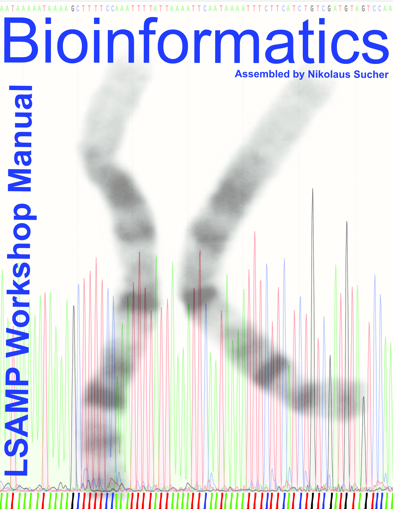

# Welcome {-}

This is the __Laboratory Manual__ for the LSAMP Bioinformatics Short course at RCC.


```{r echo=FALSE, message=FALSE, warning=FALSE}

```


This work is licensed under the [Creative Commons Attribution-Share Alike 3.0 Unported](https://creativecommons.org/licenses/by-sa/3.0/deed.en) United States License.
