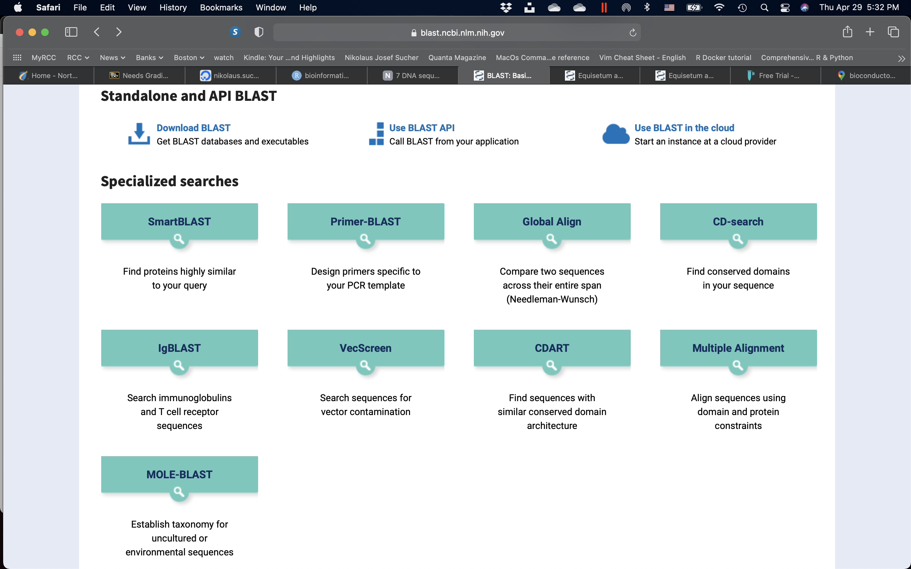
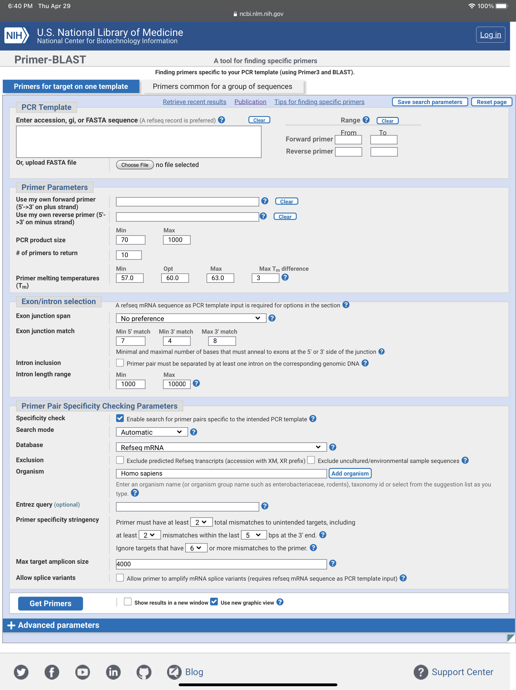
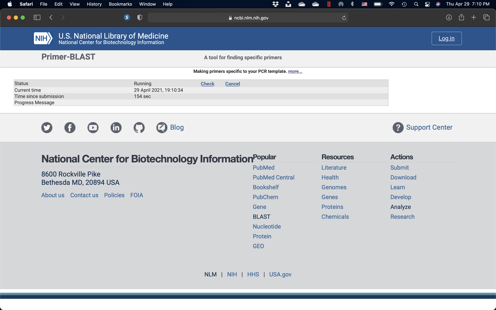
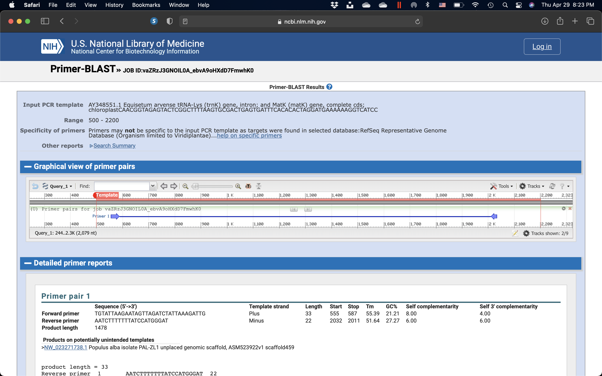

# PCR Primer Design

In this exercise, we will learn how to design primers for use in the polymerase chain reaction (PCR). PCR uses a pair of custom primers to direct DNA elongation toward each-other at opposite ends of the sequence being amplified. These primers are typically between 18 and 24 bases in length, and must code for only the specific upstream and downstream sites of the sequence being amplified. A primer that can bind to multiple regions along the DNA will amplify them all, eliminating the purpose of PCR.

A few criteria must be brought into consideration when designing a pair of PCR primers. Pairs of primers should have similar melting temperatures since annealing during PCR occurs for both strands simultaneously, and this shared melting temperature must not be either too much higher or lower than the reaction's annealing temperature. A primer with a Tm (melting temperature) too much higher than the reaction's annealing temperature may mishybridize and extend at an incorrect location along the DNA sequence. A Tm significantly lower than the annealing temperature may fail to anneal and extend at all.

Additionally, primer sequences need to be chosen to uniquely select for a region of DNA, avoiding the possibility of hybridization to a similar sequence nearby. A commonly used method for selecting a primer site is BLAST search, whereby all the possible regions to which a primer may bind can be seen. Both the nucleotide sequence as well as the primer itself can be BLAST searched. The free NCBI tool Primer-BLAST integrates primer design and BLAST search into one application, as do commercial software products such as ePrime and Beacon Designer. Computer simulations of theoretical PCR results (Electronic PCR) may be performed to assist in primer design by giving melting and annealing temperatures, etc.

Selecting a specific region of DNA for primer binding requires some additional considerations. Regions high in mononucleotide and dinucleotide repeats should be avoided, as loop formation can occur and contribute to mishybridization. Primers should not easily anneal with other primers in the mixture; this phenomenon can lead to the production of 'primer dimer' products contaminating the end solution. Primers should also not anneal strongly to themselves, as internal hairpins and loops could hinder the annealing with the template DNA.

When designing primers, additional nucleotide bases can be added to the back ends of each primer, resulting in a customized cap sequence on each end of the amplified region. One application for this practice is for use in TA cloning, a special subcloning technique similar to PCR, where efficiency can be increased by adding AG tails to the 5′ and the 3′ ends.

Some situations may call for the use of degenerate primers. These are mixtures of primers that are similar, but not identical. These may be convenient when amplifying the same gene from different organisms, as the sequences are probably similar but not identical. This technique is useful because the genetic code itself is degenerate, meaning several different codons can code for the same amino acid. This allows different organisms to have a significantly different genetic sequence that code for a highly similar protein. For this reason, degenerate primers are also used when primer design is based on protein sequence, as the specific sequence of codons are not known. Therefore, primer sequence corresponding to the amino acid isoleucine might be "ATH", where A stands for adenine, T for thymine, and H for adenine, thymine, or cytosine, according to the genetic code for each codon, using the IUPAC symbols for degenerate bases. Degenerate primers may not perfectly hybridize with a target sequence, which can greatly reduce the specificity of the PCR amplification.

Degenerate primers are widely used and extremely useful in the field of microbial ecology. They allow for the amplification of genes from thus far uncultivated microorganisms or allow the recovery of genes from organisms where genomic information is not available. Usually, degenerate primers are designed by aligning gene sequencing found in GenBank. Differences among sequences are accounted for by using IUPAC degeneracies for individual bases. PCR primers are then synthesized as a mixture of primers corresponding to all permutations of the codon sequence.

Many online tools are freely available for primer design, some of which focus on specific applications of PCR. The popular tools Primer3Plus and PrimerQuest can be used to find primers matching a wide variety of specifications. Highly degenerate primers for targeting a wide variety of DNA templates can be interactively designed using GeneFISHER. Primers with high specificity for a subset of DNA templates in the presence of many similar variants can be designed using DECIPHER. Primer design aims to generate a balance between specificity and efficiency of amplification.

## Primer-BLAST

In this exercise, our task will be to design primers for the amplification of the protein coding sequence of the matK gene that we identified in the previous exercise.

1. Open a web browser on your computer. If you are reading this in your browser, right click on the highlighted link to open the web site of the [U.S. National Library of Medicine](https://www.nlm.nih.gov) in a new tab (Fig. \@ref(fig:nlm)). Otherwise enter the link in your browser manually. 

(ref:nlm) The web page of the U.S. National Library of Medicine.

```{r nlmpage, fig.cap='(ref:nlm)', echo=FALSE, message=FALSE, warning=FALSE}

`````

2. On the U.S. National Library of Medicine web page (Fig. \@ref(fig:nlm)), click on the right most square with the DNA icon and BLAST (Basic Local Alignment Tool) written on it.
3. On the newly opened page (Fig. \@ref(fig:blast)), you will see a row of squares displaying various titles. Scroll down to "Specialized Searches". Click on the second square that has Primer-Blast written on it.

(ref:blast) The Basic Local Alignment Search Tool (BLAST) start page.

```{r blastpage, fig.cap='(ref:blast)', echo=FALSE, message=FALSE, warning=FALSE}

`````

4. A new page will open (Fig. \@ref(fig:primentry)). Click on "Choose File" and upload the sequence that you saved during the "DNA Sequence Analysis" exercise. 

(ref:primerentry) Primer-BLAST sequence entry form.

```{r primentry, fig.cap='(ref:primerentry)', echo=FALSE, message=FALSE, warning=FALSE}

`````

5. Enter the position ranges for the forward and reverse primes surrounding the protein coding sequence of the gene. The positions refer to the base numbers on the plus strand of your template (i.e., the "From" position should always be smaller than the "To" position for a given primer). Partial ranges are allowed. For example, if you want the PCR product to be located between position 100 and position 1000 on the template, you can set forward primer "From" to 100 and reverse primer "To" to 1000 (but leave the forward primer "To" and reverse primer "From" empty). Note that the position range of forward primer may not overlap with that of reverse primer. Set the appropriate length, choose, "" in the "organism" field. Click on the "Get Primers" button (Fig. \@ref(fig:primentry).

6. A new page will open that will be updated every 2 seconds while your query is being processed (Fig. \@ref(fig:primerstatus)). 

```{r primerstatus, fig.cap='The BLASTN query status updated page.', echo=FALSE, message=FALSE, warning=FALSE}

`````

7. Once the search has completed, the BLASTN results page will open (Fig. \@ref(fig:results)).

```{r results, fig.cap='The Primer-BLAST results page.', echo=FALSE, message=FALSE, warning=FALSE}

`````

8. Did the program return suitable forward and reverse primers? If not, why not? You may have to repeat the search with modified paramaters. Which parameters can you modify? Which parameters do you need to leave unchanged?

9. If, after several tries you still don't get suitable primers, you may have to choose primers "by hand". You can then use the program to determine their T~m~ and G/C content.
