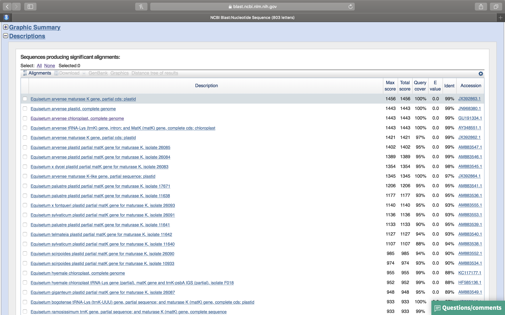

# Dna Sequence Analysis

In this exercise, we will learn how to work with DNA sequence data. We will learn how to use various offline and online bioinformatics software tools. In a previous experiment, genomic DNA was isolated from an organism and used as template in a polymerase change reaction (PCR). The primers for the PCR were chosen in the coding region of a gene that is used for "barcoding" of biological species belonging to one of the four kingdoms of eykaryotic organisms. The PCR products were used for DNA sequencing using the Sanger method. 

```{r sequencingdata, out.width='75%', echo=FALSE, message=FALSE, warning=FALSE, results=FALSE}

#Install Bioconductor

#function testing if packages are installed
installBiocManager <- function(x){
if(x %in% rownames(installed.packages())==FALSE) {
  if (!requireNamespace("BiocManager", quietly = TRUE))
      install.packages("BiocManager")
  BiocManager::install(x,ask = FALSE)
  }  
}

#install necessary Bioconductor packages
required_packages  <- c("BiocManager", "sangerseqR", "Biostrings")
lapply(required_packages,installBiocManager)

#load packages
library(sangerseqR)
library(Biostrings)

#set working directory
setwd("~/Dropbox/R/bioinformatics")

#read sequence file
sequence <- readsangerseq("data/78_4212_91_EQ-CHF3_4239_SQ_F10_035.ab1")
#save the chromatogram to a pdf file
chromatogram(sequence, width = 100, height = 2, 
             filename = "data/sequence_chromatogram.pdf")                    

seq_text <- primarySeq(sequence, string = TRUE)
write_file(seq_text, "./data/seq_text.txt")
```

(ref:chromatogram) The DNA sequence chromatorgram obtained from sequencing the PCR products from the unknown organism.

```{r chrom, fig.cap='(ref:chromatogram)', echo=FALSE, message=FALSE, warning=FALSE}
knitr::include_graphics("./data/sequence_chromatogram.pdf")

```


## BLAST search

We will use the BLAST (basic local alignment tool) program to compare our dna with all dna sequences stored in genbank. [Genbank](https://www.ncbi.nlm.nih.gov/genbank/) is the nih genetic sequence database, an annotated collection of all publicly available dna sequences. genbank is part of the international nucleotide sequence database collaboration, which comprises the dna databank of japan (ddbj), the european nucleotide archive (ena), and genbank at ncbi. these three organizations exchange data on a daily basis.

There are several ways to search and retrieve data from genbank:

1. Search genbank for sequence identifiers and annotations with entrez nucleotide, which is divided into three divisions:
    * corenucleotide (the main collection)
    * dbest (expressed sequence tags)
    * dbgss (genome survey sequences).
2. Search and align genbank sequences to a query sequence using BLAST (basic local alignment search tool).

We will use BLAST to search te corenucleotide main collection.

1. Open a web browser on your computer. If you are reading this in your browser, right click on the highlighted link to open the web site of the [U.S. National Library of Medicine](https://www.nlm.nih.gov) in a new tab (fig. \@ref(fig:nlm)). otherwise enter the link in your browser manually. 

(ref:nlm) The web page of the U.S. National Library of Medicine.

```{r nlm, fig.cap='(ref:nlm)', echo=FALSE, message=FALSE, warning=FALSE}
knitr::include_graphics("./figures/bioinformatics/nlm.png")
`````

2. On the U.S. National Library of Medicine web page (fig. \@ref(fig:nlm)), click on the right most square with the dna icon and BLAST (basic local alignment tool) written on it.
3. On the newly opened page (fig. \@ref(fig:blast)), you will see a row of squares displaying various titles. click on the left most square that has nucleotide BLAST written on it.

(ref:blast) The basic local alignment search tool (BLAST) start page.

```{r blast, fig.cap='(ref:blast)', echo=FALSE, message=FALSE, warning=FALSE}
knitr::include_graphics("./figures/bioinformatics/blast.png")
`````

4. Copy the following sequence to your clipboard:

```{bash, echo=FALSE, warning=FALSE, comment = ""}
cat ./data/seq_text.txt | fold -w 84 | sed 's/#>//'
```

5. A new page will open. Paste your DNA sequence into the white box on the top left (Fig. \@ref(fig:sequence)). 

(ref:sequence) Nucleotide BLAST (BLASTN) sequence entry form.

```{r sequence, fig.cap='(ref:sequence)', echo=FALSE, message=FALSE, warning=FALSE}
knitr::include_graphics("./figures/bioinformatics/sequence_entry.png")
`````

6. Leave the default values unchanged and click on the oval blue button at the lower left that has BLAST written on it (Fig. \@ref(fig:click)). This will upload your sequence (referred to from now on as the **Query** sequence) to the server where it will be compared to all sequences on record. 

```{r click, fig.cap='After you have pasted your sequence into the sequence entry field, click the BLAST button at the lower left of the page.', echo=FALSE, message=FALSE, warning=FALSE}
knitr::include_graphics("./figures/bioinformatics/click_blast.png")
`````

7. A new page will open that will be updated every 2 seconds while your query is being processed (Fig. \@ref(fig:status)). 

```{r status, fig.cap='The BLASTN query status updated page.', echo=FALSE, message=FALSE, warning=FALSE}
knitr::include_graphics("./figures/bioinformatics/job_id.png")
`````

8. Once the search has completed, the BLASTN results page will open (Fig. \@ref(fig:results)).

```{r results, fig.cap='The BLASTN results page.', echo=FALSE, message=FALSE, warning=FALSE}
knitr::include_graphics("./figures/bioinformatics/results.png")
`````

9. Click on the "+" sign in front of "Graphic Summary" (Fig. \@ref(fig:results)). A graphical summary of your results will be shown (Fig. \@ref(fig:graphic). The light green line on top represents your query sequence, below are shown any retreived sequences that align with your sequence.

```{r graphic, fig.cap='Graphic summary of the BLASTN search results.', echo=FALSE, message=FALSE, warning=FALSE}
knitr::include_graphics("./figures/bioinformatics/graphic_summary.png")
`````

10. Click on the "+" sign in front of "Description" (Fig. \@ref(fig:description)). A list of sequences that align with your query sequence will be shown (Fig. \@ref(fig:description).

```{r description, fig.cap='List of sequences producing significant alignments with your query sequence.', echo=FALSE, message=FALSE, warning=FALSE}

`````

11. Click on the first sequence. A new page will showing the alignment of the query sequence with the retrieved sequence (Fig. \@ref(fig:alignment)).

```{r alignment, fig.cap='Alignment of the best retrieved sequence with the query sequence.', echo=FALSE, message=FALSE, warning=FALSE}
knitr::include_graphics("./figures/bioinformatics/alignment.png")
`````

12. Which sequence matches our query sequence?

13. Is this sequence linked to a scientific publication? If so, download the original paper.

12. What is the scientific name of the organism that has a matching sequence? What is the common English name of this organism? What type of organism is it?

13. What is the name of the gene that matches this sequence? Does the query sequence correspond to a partial or the full-length sequence of this gene?

14. Go back to the list of sequence alignments produced by BLAST. Look for the sequnce with GenBank accession AY348551.1 (accession identifiers are listed in the left most column). Click on it. A new page will open. Towards the top left of the page, just above the title, click on "Send to" (Fig. \@ref(fig:fasta)), in the pop-up, make sure that "Complete Record" is highlighted, and under "Choose Destination", click on "File", then under "Format", choose "Fasta", and then click on "Create File". Save the file for use in the "Design PCR Primers" exercise. 
.

```{r fasta, fig.cap='Save the gene sequence in FASTA format', echo=FALSE, message=FALSE, warning=FALSE}

`````

14. On which chromosome is this gene located? How many nucleotides does this chromosome have?

14. How many amino acids does the full-lenght gene code for?

14. Find open reading frame (ORF) in the sequence. Write down the nucleotide mumber correspondin to the the beginning of the start codon. Find the stop codon. Write down the number of the last nucleotide of the stop codon. You will need those numbers in the next exercise ("Design of PCR Primers").

15. What is the function of this gene in the organism?
